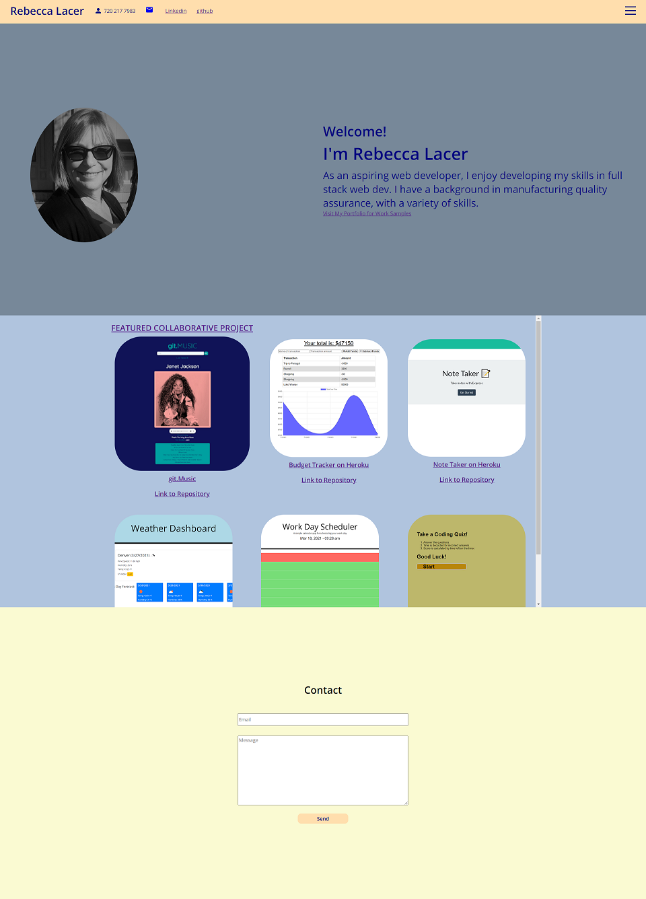

# React Portfolio

  # Table of Contents       

* [License](#license)

 * [Description](#description)
 * [Usage](#usage)
 * [Test](#test)

 * [Author](#author)
 * [Contributors](#contributors)
 * [Contact](#contact)
 * [Link](#link)
 * [Screenshots](#screenshots)
 
## License
    
    This project is licensed under the MIT
 
 ## Description:
* This React App contains information about me, Rebecca Lacer.
* There is a menu to navigate to the different sections.
* There are samples of my work included in the portfolio section.
* The contact section is not yet connected, but is there as a placeholder for future development.
 ## Usage:
 * To showcase my work to prospective employers
 
 ## Test:
  * Currently there is no test available
 
 

 
 ### Author:
  Rebecca Lacer 
 
 
 ### Contributors:
  N/A
 
 
 ### Contact
 
* Github: https://github.com/RLacer
* Email: r.a.lacer@hotmail.com

### Link
* Deployment: 
* Github Repository: https://github.com/RLacer/React-Portfolio

## Screenshots

<footer>This readme was generated using my homework assignment 9, Node.js readme generator.🏫</footer>

